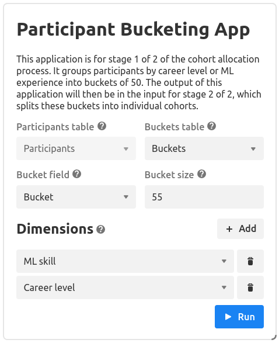

# bluedot-impact-bucketing-airtable-extension

AirTable extension for grouping programme participants into buckets.

- User tutorial: https://youtu.be/Wosve9hEEPo
- Technical runthrough: https://youtu.be/uAWIhIGkVg0

## Context

The BlueDot Impact programmes bring together participants to meet weekly around a discussion topic. To make these discussions as productive as possible, they aim to match people into buckets of roughly similar backgrounds (e.g career stages and knowledge about the discussion topics).

This Airtable extension runs on a base with 'Participants' and 'Buckets' tables. You select the dimensions on which you wish to group participants by, and they are appropriately bucketed and clustered by these dimensions.

A second step in this pipeline is to further split these buckets into cohorts by availabilities. However, this is out of scope for this project.

## User instructions

> Warning: Existing participants in the view will have their bucket allocations overriden

1. Open the base with the Participants and Buckets tables.
2. Open the 'Extensions' side panel in Airtable, and navigate to the 'Participant Bucketing App' extension.
3. Set the relevant settings in the extension window, and click the 'Run' button.

## Code structure

There are three main parts:

- InputCollector: [`InputCollector.tsx`](./frontend/InputCollector.tsx), which renders the form fields to collect input into the Airtable extension's Global Config.
- Runner: [`Runner.tsx`](./frontend/Runner.tsx), which parses and validates the inputs, calls the clustering algorithm, and updates Airtable with the results.
- Clustering algorithm: In the [`lib`](./lib) folder, which is the underlying algorithm for grouping by the dimensions itself.

There are also some helpers, and the main entrypoint [`frontend/index.tsx`](./frontend/index.tsx)

## Contributing

To start developing this extension:

1. Clone this git repository
2. Install [Node.js](https://nodejs.org/)
3. Run `npm install`
4. Run `npm start` (for the 'Bucketing Extension Base' in the BlueDot Impact software AirTable account)
5. Load the relevant base
6. Make changes to the code and see them reflected in the app!

If the changes don't appear to be updating the app, try clicking the extension name then 'Edit extension', then pasting in the server address printed to the console from step 4 (probably `https://localhost:9000`).

Test files end in `.test.ts` or `.test.tsx`. You can run the tests with `npm test`.

Release new versions using `npm run release` (for your local base) or `npm run release:shared` (for the shared base). If you get the error `airtableApiBlockNotFound`, set up the block CLI with `npx block set-api-key`, getting your API key from the [AirTable account settings page](https://airtable.com/account).

If you want to install this on a new base see [these instructions](https://www.airtable.com/developers/apps/guides/run-in-multiple-bases).
